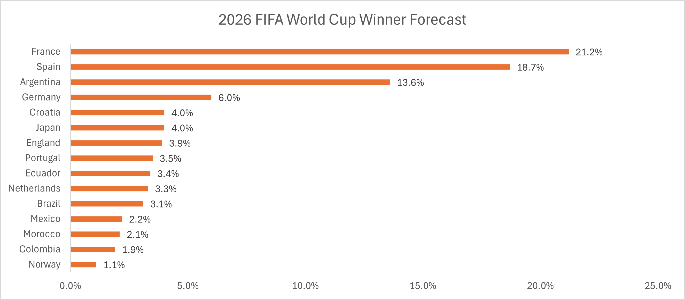
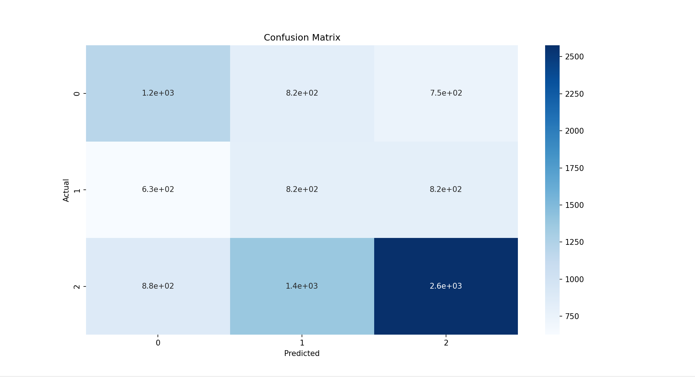

# FIFA World Cup 2026 Predictor

A machine learning and Monte Carlo simulation project that forecasts the 2026 FIFA World Cup using historical international football results, Elo ratings, engineered team performance metrics, and tournament simulation.

---

# 2026 FIFA World Cup Forecast

Based on 10,000 tournament simulations.



Forecast generated from 10,000 Monte Carlo simulations using machine-learning-based match probabilities and Elo ratings.

**Simulation Settings**

- 10,000 Monte Carlo simulations
- Logistic Regression match prediction model
- Elo ratings included
- Historical international match data used for training

## Top Title Probabilities

| Team | Probability |
|--------|------------|
| France | 21.2% |
| Spain | 18.7% |
| Argentina | 13.6% |
| Germany | 6.0% |
| Japan | 4.0% |
| Croatia | 4.0% |
| England | 3.9% |
| Portugal | 3.5% |
| Ecuador | 3.4% |
| Netherlands | 3.3% |

---

# Project Overview

The project combines:

- Machine Learning
- Elo Ratings
- Feature Engineering
- Probabilistic Forecasting
- Monte Carlo Simulation

to estimate the probability of every team winning the 2026 FIFA World Cup.

---

# Methodology

## Match Prediction Model

A multiclass Logistic Regression model predicts:

- Away Win
- Draw
- Home Win

for every match.

The model outputs probabilities rather than deterministic predictions.

Example:

| Outcome | Probability |
|----------|-------------|
| Away Win | 30% |
| Draw | 35% |
| Home Win | 35% |


### Model Evaluation



---

## Features Used

### Team Form

Measures recent performance over previous matches.

### Attack Difference

Difference in attacking strength between teams.

### Defence Difference

Difference in defensive performance.

### Dominance Difference

Captures overall control and effectiveness.

### Closeness Metrics

Measures how evenly matched two teams are.

### Elo Ratings

International football Elo ratings are incorporated to capture long-term team strength.

---

# World Cup Simulation Engine

The simulator:

1. Simulates all group-stage matches.
2. Calculates standings.
3. Identifies group winners and runners-up.
4. Selects the best third-place teams.
5. Advances teams through:
   - Round of 32
   - Round of 16
   - Quarterfinals
   - Semifinals
   - Final
6. Repeats the tournament thousands of times.

---

# Machine Learning Concepts Used

- Feature Engineering
- Logistic Regression
- Multiclass Classification
- Probability Forecasting
- Class Balancing
- Correlation Analysis
- Model Evaluation
- Monte Carlo Simulation

---

# Project Structure

```text
FIFA_World_Cup_Predictor/

├── data/
│   ├── world_cup_groups.csv
│   ├── world_cup_fixtures.csv
│
├── images/
│   ├── Confusion_matrix.png
│   ├── world_cup_winner_forecast.png
│
├── output/
│   ├── world_cup_predictions.csv
│   ├── world_cup_predictions.xlsx
│
├── src/
│   ├── train_model.py
│   ├── prediction_engine.py
│   ├── simulate_match.py
│   ├── elo_ratings.py
│   ├── extract_groups.py
│   ├── world_cup_simulator.py
│
├── README.md
├── requirements.txt
```

# Installation

Clone the repository:

```bash
git clone https://github.com/arkyamitra/FIFA_World_Cup_Predictor.git
```

Install dependencies:

```bash
pip install -r requirements.txt
```

Run the simulator:

```bash
python src/world_cup_simulator.py
```

# Results

The simulation identifies:

- France as the tournament favourite.
- Spain as the strongest challenger.
- Argentina as a clear third contender.
- Ecuador as a potential dark horse due to strong defensive metrics.
- Traditional powers such as Brazil and England remained competitive but were not among the strongest title favourites in the simulation.

---

# Project Status

✅ Completed

This project successfully combines machine learning, Elo ratings, feature engineering, and Monte Carlo simulation to forecast the 2026 FIFA World Cup.

The current version includes:

- Match outcome prediction using Logistic Regression
- Elo rating integration
- Feature-engineered team strength metrics
- Group stage simulation
- Knockout stage simulation
- 10,000 tournament Monte Carlo simulations
- Championship probability forecasting

The repository is maintained as a completed sports analytics portfolio project.

---


# Author

Arkya Mitra

Sports Analytics • Machine Learning • Marketing Analytics

GitHub: github.com/arkyamitra
